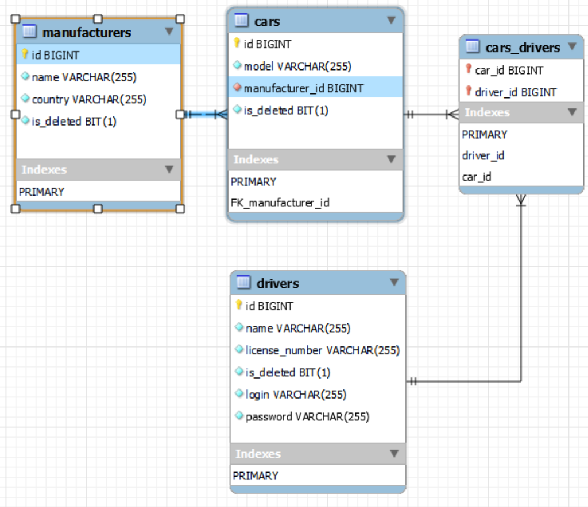

# Taxi service

### Project description
This is an educational project. 
Which have to show how to work with database via JDBC, with Java Servlet 
and divide code into different levels.

Project has next features:
- Authentication form
- Registration form
- Cars (show all / add / delete)
- Drivers (show all / add / delete)
- Manufacturers (show all / add / delete)
- Add driver to car
- Delete driver from car
- Display cars for logged driver

### Run application in your browser
Follow the [link](https://gdp-taxi-service.herokuapp.com)

### Project represents N-layer architecture
Layers:
- Presentation layer
- Controller layer
- Service layer
- Data access layer

### Database diagram

### Technologies used in project
- Java v.11
- Apache Tomcat v.9
- MySQL v.8
- Maven v.3.8
- Java Servlet v.4
- JSTL v.1.2
- In project used pattern of Dependency Injector

### To run project
- You should have installed version of Apache Tomcat, MySQL, Git, Maven, Java
- Clone the project from GitHub
- Initialise database. Use for that src/main/resources/init_db.sql
- Configure database connection. Use for that environment variables: 
DATABASE_HOST, DATABASE_NAME, DATABASE_USERNAME, DATABASE_PASSWORD 
